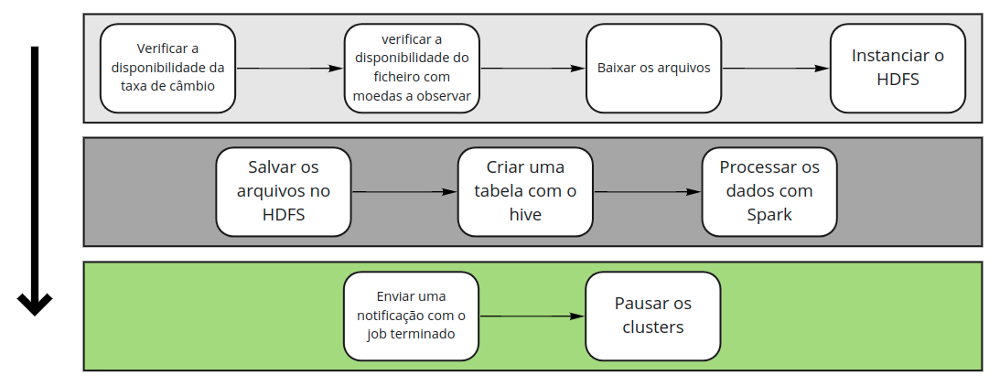
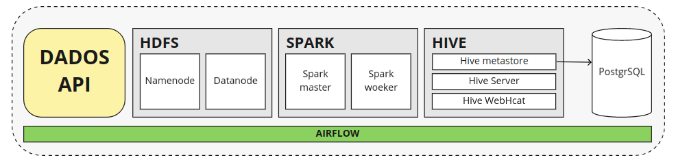

# Estruturando a coleta de dados Yahoo Forex

Esse projeto foi baseado em uma aplicação realizada por Mark Lamberti em seu curso [Apache airflow: the hands-on guide](https://www.udemy.com/course/the-ultimate-hands-on-course-to-master-apache-airflow/).
--

---
O yahoo finance ou forex como é conhecido  trata-se de um site que informa relatórios atualizados a cada mudança do mercado finaceiro. Além disso ele nos permite comparar muitas das moedas globais e exportar estes dados.

> Desde 2017 lidera os sites de noticias financeiras. Neste mesmo ano o site recebeu premio de maior site de notícias de negócios dos Estados Unidos em tráfego mensal.

Como o titulo diz, vamos estruturar a coleta de dados do yahoo forex e nada melhor que uma pipeline para conseguirmos gerir e monitorar esta coleta. 

* (1) Vamos criar uma função que vai coletar esses dados conforme escolhermos.
* (2) Vamos instanciar o **HDFS, HIVE e o SPARK** para gerir esses dados coletados.
* (3) Por fim informar por email e pausar os clusters ao termino da aplicação.
  
Realizando um Drill-Down, montamos um fluxograma explicando melhor cada umas das etapas que esta representado na imagem abaixo:

> Para instanciar todos esses serviços vamos utilizar a liguagem `Python` e criar o ambiente de execução vamos utilizar o `Docker`.

Para instanciar todos os serviços como uma imagem utilizaremos a prática do `Docker compose` que nos possibilita definir e executar aplicativos Docker de vários contêineres. Claro, ainda precisamos dos `dockerfiles`, mas os gereciamos agora pelo `yml` do **docker compose**.

> Em seu funcionamento o docker compose gera networks entre os containers possibilitando assim a sua execução em conjunto.

> Lembre-se de criar um limite de hardware, caso você esteja no `linux` isso pode fazer com que a sua aplicação finalise por exeder a memória.

Tendo o fluxograma podemos pensar na arquitetura de toda pipeline, a imagem abaixo representa toda pipeline como estrutura.

Para isso tomamos como estrtura e funções:
--

* (1) Montar uma função **Python** que consiguirá acessar os dados. Para esta aplicação, os já ficam disponiveis em uma API ao qual todos tem acesso por ela ser publica. Logo, não precisamos montar nenhum websacrping para coleta.

* (2) Por meio do **Apache hadoop** conseguimos alocar os dados de forma distribuida, dessa maneira vamos instacialos utilizando o seu serviço HDFS que realiza o alocamento dos dados de forma distribuida na HD.
  
* (3) Para processar os dados precisaremos de uma ferramenta que suporte grande quantidade de dados. Dessa forma, temos o **Spark** que realiza esse processamento de forma paralela o que possibilita a transformação e a gestão de grande lotes de dados.

* (4) Para organizar os dados de forma eficiente vamos utilizar o **Hive** que trata-se de um software que trabalha direntamenta com datawarehouse (Estruturas otimizadas para leitura de dados, de forma a acelearar a análise dos dados).
  
* (5) todos os dados alocados pelo Hive vão ser disponibilizados em um banco de dados que como escolha tomamos o **PostgreSQL**.

* (6) Por fim temos o **Apache Airflow** que irá fazer todo orquestramento e agendamento das tarefas realizadas.
  

#  Tendo todas as tarefas listadas **Let's get hands-on**

> **OBS:**  Em cada uma das pastas alocadas deixarei um resumo de cada atividade realizada e uma explicanção mais aprofundada de cada processo.